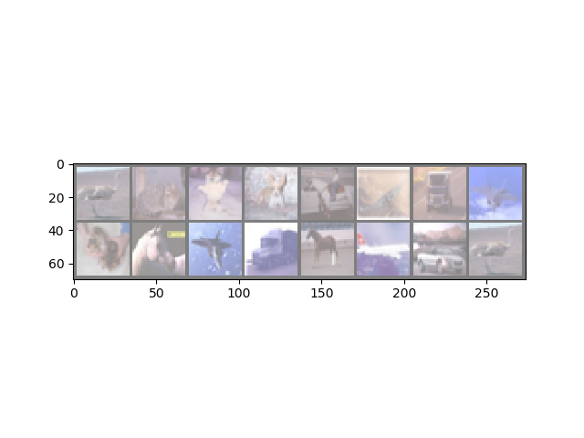
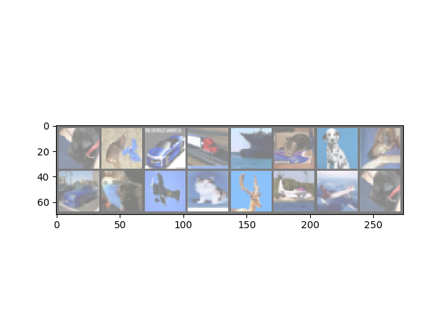
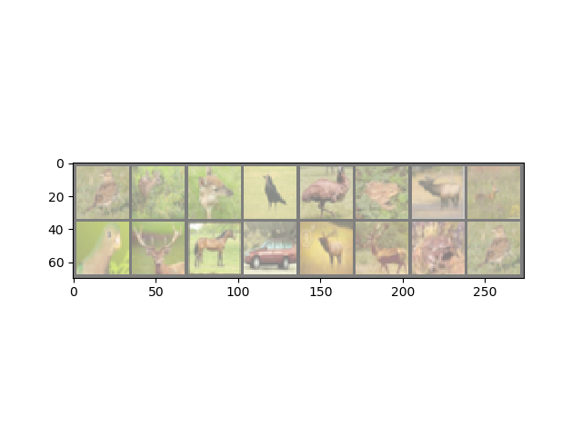

# Deepinfo_pytorch
a pytorch implementation of deepinfo(Learning deep representations by mutual information estimation and maximization)
## version 

python3 pytorch 0.4.0 

## results 

## reference 
> https://spaces.ac.cn/archives/6024

> https://arxiv.org/abs/1808.06670 

